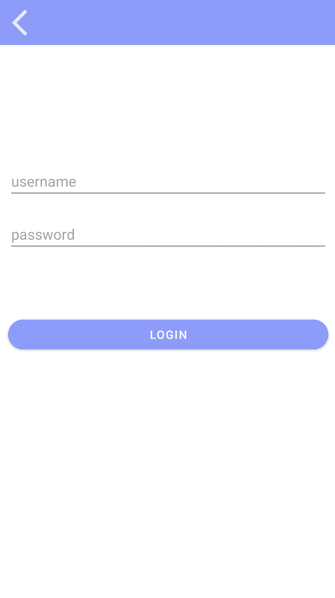
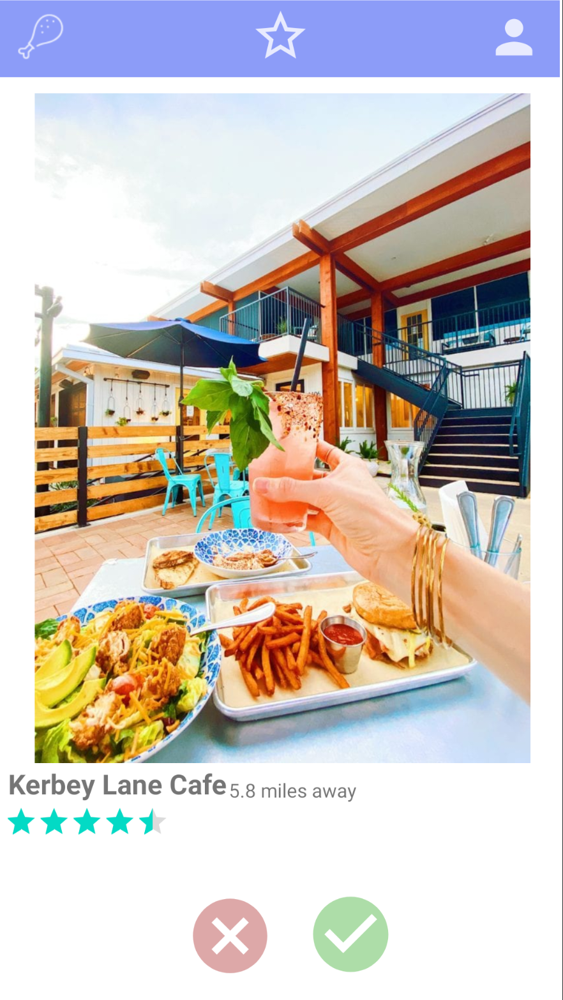
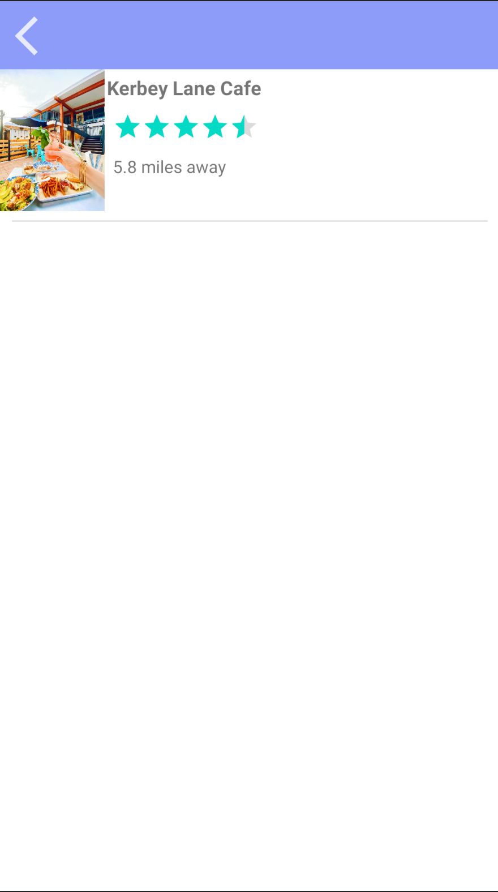
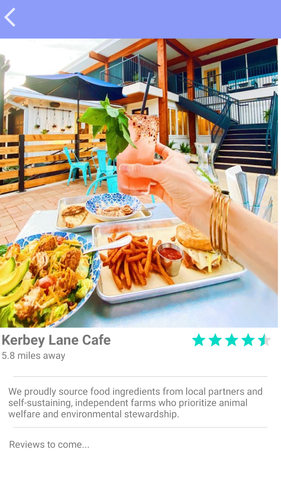
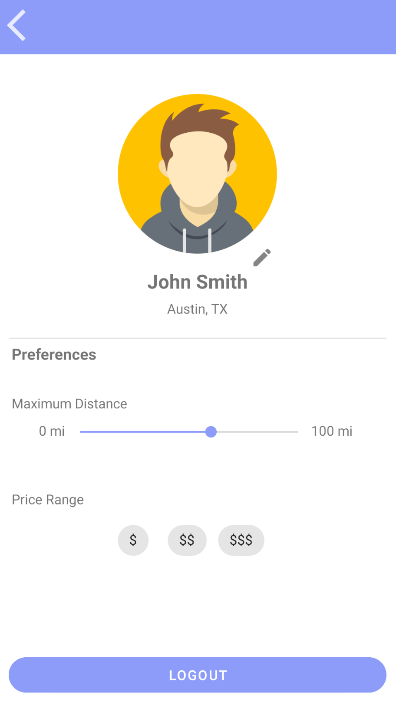
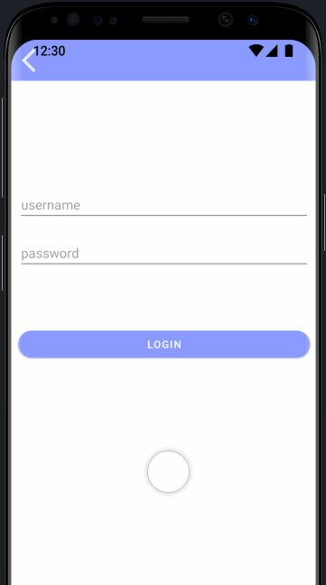

# Tender

## Table of Contents
1. [Overview](#overview)
2. [Product Spec](#product-spec)
3. [Wireframes](#wireframes)
4. [Schema](#schema)

## Overview
### Description
Tender is a restaurant browsing app that fetches data from the Yelp API and uses a Parse database for user authentication. Similar to the popular app Tinder, users can swipe through a deck to like or dislike restaurant profiles, which generally comprise a photo gallery, business information, and distance from the user. The app also provides features such as google maps navigation, a chat feature, and restaurant search filtering.

### App Evaluation

- **Category:** Food
- **Mobile:** This app provides an easy and fun way to find food near you. Browsing restaurant websites online is often frustrating on a mobile device so this app makes it a clean, simple process.
- **Story:** A user will be provided with a set of food options which can be filtered based on preferences such as type of food, price level, and distance. The user can then swipe to indicate interest or disinterest in the food service. When the user is interested in a restaurant, the app will offer them extra details and navigation to the service.
- **Market:** This app is targeted mostly towards young adults who are likely familiar with the tinder platform and eat out frequently. Generally, however, the app can be used by anyone searching for a place to eat near them.
- **Habit:** This app is used when the user needs to eat a meal but cannot decide where to eat or wants to try something new.
- **Scope:** This app can have varying levels of technicality. It's basic form will simply be a swiping app in which restaurants can be added to an interested list. Then, additional features such as navigation and search filtering can be addded.

## Product Spec

### 1. User Stories (Required and Optional)

The following **must-have** features are completed:

- [x] User can login to their profile
- [x] User can view a set of restaurants (displayed as a deck of cards)
- [x] User can swipe left to dismiss the card or swipe right to add the card to their interested list
- [x] User can view a list of restaurants they are interested in
- [x] User can remove restaurants from their interested list
- [x] User can view a detailed screen of information on a specific restaurant

The following **extra** features are complete:

- [x] User can view a restaurant profile with additional information by swiping up on a restaurant in the deck
- [x] User can change filters on what restaurants are generated (max radius, price level, and food categories)
- [x] User can get navigation to a restaurant
- [x] User can view yelp reviews of a restaurant
- [ ] User can view and personalize their profile (profile image and name)
- [x] The app has a logo and coherent theme throughout
- [x] User can create a new account
- [x] User can log out of their profile
- [x] Each restaurant has a comments page where users can leave comments on places in their favorites list

### 2. Screen Archetypes

* Login view
   * User can login to their profile
   * The app has a logo and coherent theme
* Signup view
   * User can create an account 
* Card view
   * User can view a set of restaurants
   * User can swipe left and right depending on their oppinion
   * User can swipe up to view detailed restaurant profile (bussiness info, hours, and gallery)
* Favorites view
    * User can view a list of restaurants they are interested in 
    * User can remove restaurants from their interested list
* Details view
    * User can view a screen with extra information on a specific restaurant (information includes 5-star rating, location, bussiness hours, map, etc.)
    * User can get navigation to the restaurant
    * User can view yelp reviews of the restaurant
* Comments view
    * User can leave a comments on the resturant
    * User can view a list of comments made by other users of the app
* Profile view
    * User can personalize their viewing preferences
    * User can personalize their profile
    * User can log out of their account

### 3. Navigation

**Tab Navigation** (Tab to Screen)

* Swipe screen
* Favorites screen
* Profile screen

**Flow Navigation** (Screen to Screen)

* Login screen
   * Home screen
* Swipe screen
   * Favorites screen
   * Profile screen
* Favorites screen
    * Details screen
* Account settings screen
    * Home screen

## Wireframes

### Digital Wireframes

     

### Demo Video

Here is a demo of the app wirframes:

GIF created with [LiceCAP](https://www.cockos.com/licecap/).

## Schema

### Models

Restaurant

| Property | Type | Description |
| -------- | -------- | -------- |
| id     | string     | Unique Yelp ID of this business.|
| name     | string     | Name of this business.|
| categories     | object[]     | List of category title and alias pairs associated with this business.     |
| image_url     | string     | URL of photo for this business|
| website_url | string | URL for business page on Yelp. |
| rating     | number | Rating for this business (value ranges from 1, 1.5, ... 4.5, 5).|
| phone_num     | string     | 	Phone number of the business.|
| location     | object     | Location of this business, including address, city, state, zip code and country. |
| hours     | object[] | Opening hours for bussiness |
| distance | number | Distance in meters from the search location. This returns meters regardless of the locale. |
| price | string | Price level of the business.|
| reviews | review[] | List of reviews on the bussiness. |

Review

| Property | Type | Description |
| -------- | -------- | -------- |
| username     | string     | User screen name. |
| text     | string     | Text excerpt of this review.|
| rating     | number     | Rating for this review. |
| image_url     | string     | URL of the user's profile photo.|
| time_created | string | Time at which the review was posted |

User

| Property | Type | Description |
| -------- | -------- | -------- |
| username     | string     | User screen name |
| name     | string     | Name of user|
| location     | string     | Location of user |
| profile_url | string     | URL of profile picture |
| radius | number | Maximum radius in which user wants to view restaurants |
| price     | number | price range of restaurants user wants to view |
| categories | string[] | Categories of restaurants to filter search results | 
| open_now | boolean | If true, user only wants to be shown food that is currently open |

### Networking

#### List of network requests to Parse database by screen

* Swipe Screen
    * (Read/GET) Retrieve logged in user preferences to feed to Yelp API
 
* Profile Screen
    * (Read/GET) Query logged in user object
    * (Update/PUT) Update user profile info (profile image, name, and preferences)

#### Network requests for Yelp API

| HTTP Verb | Endpoint | Description |
| -------- | -------- | -------- |
| GET     | /bussinesses/search | Retrieves all restaurants with provided parameters |
| GET     | /businesses/{id}    | Retrieves mre specific information of restaurant given id |
| GET     | /businesses/{id}/reviews     | Retrieves a list of reviews provided a restaurant id|
